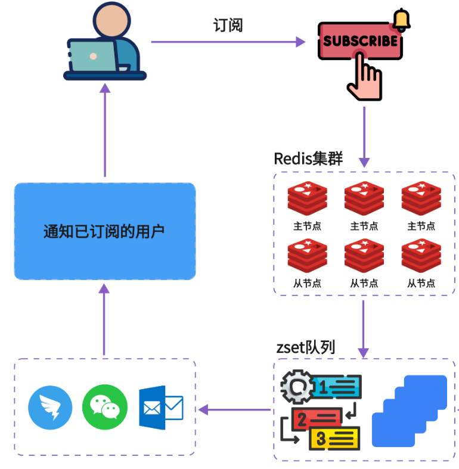
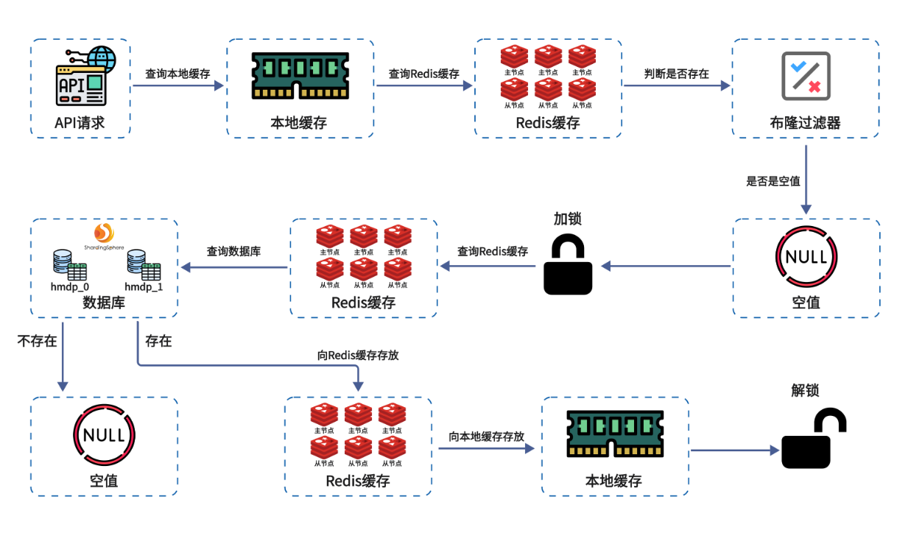

<div align="center">
  <h1>Weibo-tea微博-奶茶</h1>
    <h5>Weibo-tea：C2C经营模式，多个商家，多个买家。奶茶团购，由管理员，用户，商家三方组成。微博奶茶，由Spring Boot + Vue 3的前后端分离设计，使用redis中间件+nginx分布式系统。<h5>
    <h1>配置要求</h1>
    
    
    
    
    
    
</div>


## 项目结构

weibo-tea/说明/wiki.md

## 接口文档

weibo-tea/说明/user.md

weibo-tea/说明/emp.md

weibo-tea/说明/admin.md

# 前端说明

## 管理端

## 用户端

------

# 后端说明

### 组件：Redis分布式ID生成器（RedisID）

```java
@Component
public class RedisID {
    // 基准时间：2020-01-01 00:00:00 UTC
    private final static long BEGIN_TIME = 1577836800L;
    // 32位序号最大值
    private static final long MAX_SEQ = 0xFFFFFFFFL;

    public long createId(String prefix) {
        long nowSeconds = ZonedDateTime.now(ZoneOffset.UTC).toEpochSecond();
        long timestamp = nowSeconds - BEGIN_TIME;
        
        String date = ZonedDateTime.now(ZoneOffset.UTC)
            .format(DateTimeFormatter.ofPattern("yyyy:MM:dd"));
        String key = "icr:" + prefix + ":" + date;
        long count = stringRedisTemplate.opsForValue().increment(key);
        
        return timestamp << 32 | count;
    }
}
```

Q：为什么不用UUID？

> A：UUID是随机字符串，无序，作为数据库主键会导致索引分裂，影响性能。而且UUID太长（36位），存储和传输成本高。

Q：为什么不用数据库自增ID？

> A：数据库自增ID在分布式环境下需要额外处理（比如分库分表），而且生成ID需要访问数据库，性能不如Redis。

Q：ID结构为什么是 1位符号位+时间戳(31位) + 序号(32位)？

> A：0作为符号位，正数自增，31位时间戳可以表示约68年（2^31秒 ≈ 68年），从2020年开始够用。32位序号可以表示约42亿，足够单日并发使用

---


## 一、用户管理模块

### model



### 实现过程

---

## 二、探店和文章管理

### model



### 迭代过程

Q：为什么用逻辑过期而不是物理过期？

> A：物理过期的话，缓存过期瞬间会有大量请求穿透到数据库（缓存击穿）。逻辑过期是缓存永不过期，但在数据中记录过期时间，过期后通过分布式锁让一个线程去更新缓存，其他线程返回旧数据，这样不会导致数据库压力骤增。

Q：为什么不直接用@Cacheable注解？

> A：@Cacheable是Spring提供的声明式缓存，虽然方便但不够灵活。比如需要自定义缓存策略、分布式锁控制、逻辑过期等场景，手动控制Redis操作更合适。

Q: 缓存击穿问题 - 热点文章缓存过期瞬间，大量请求同时穿透到数据库

> 使用分布式锁（RedisLock）+ 逻辑过期策略

Q：为什么复用文章模块的缓存策略？

> A：分类数据和文章数据的缓存需求相似——都是读多写少、需要防止缓存击穿。复用相同的逻辑过期+分布式锁策略可以减少代码重复，提高可维护性。

Q：分类和文章的缓存策略有什么差异？

> A：分类数据量更小（通常几十到几百个），缓存命中率更高，可以设置更长的逻辑过期时间。而文章数据量大，需要更频繁地更新缓存。

Q: 分类修改后，文章页面显示的分类名称没有更新

> 在分类更新/删除时主动删除缓存，确保下次查询时从数据库获取最新数据

```java
@Override
public Boolean updateCache(Category category) {
    String key = KEYS + category.getId();
    boolean result = super.updateById(category);
    stringRedisTemplate.delete(key);  // 删除缓存
    return result;
}
```

Q：为什么点赞用Redis的ZSet而不是普通Set？

> A：ZSet可以存储分数（timestamp），这样可以按点赞时间排序，方便获取热门点赞用户。同时ZSet的score操作是原子的，不会出现并发问题。

Q：为什么点赞数同时存Redis和MySQL？

> A：Redis用于实时查询和计数，MySQL用于持久化存储。点赞操作先更新MySQL再更新Redis，保证数据最终一致性。

Q:点赞操作在高并发下可能出现计数不准确

> MySQL使用原子操作 `setSql("liked= liked + 1")`，Redis使用ZSet的原子add/remove操作，保证计数一致性。

Q：为什么用parent_id区分评论和回复？

> A：`parent_id = 0` 表示直接评论博文，`parent_id = 1` 表示回复其他评论。这种设计可以支持无限层级的回复，同时查询时可以通过parent_id区分评论和回复。

Q：评论表为什么需要answer_id字段？

> A：`answer_id` 记录回复目标评论的ID，用于构建评论的回复链，方便前端展示回复关系。

Q：评论状态管理（正常、被举报、禁止查看）

> 修复方案：在blog_comments表中设置status字段，0表示正常，1表示被举报，2表示禁止查看。查询时过滤掉status=2的评论。

---

## 三、文件管理模块

### model

## 四、优惠券使用的并发

### 秒杀流程图

**同步版本流程**

```
用户请求 → 校验秒杀活动 → 生成订单ID → 直接调用secondKill() → 扣库存+保存订单 → 返回结果
```

**异步单机流程**

```
用户请求 → 校验秒杀活动 → Lua脚本校验 → 放入ArrayBlockingQueue → 返回订单ID
                                                              ↓
                                        后台线程 take() → RedisLock → paySuccess() → 扣库存+保存订单
```

**异步分布式流程**

```
用户请求 → 校验秒杀活动 → Lua脚本校验（自动XADD到Stream）→ 返回订单ID
                                                         ↓
                                XREADGROUP读取 → 解析订单 → secondKill() → 扣库存+保存订单 → ACK确认
```

**数据库操作阶段**

1. **一人一单校验**：在事务中基于用户ID和优惠券ID查询已存在订单
2. **原子库存扣减**：使用 MyBatis Plus 的乐观锁 CAS 操作保证库存扣减的原子性
3. **订单创建**：保存订单记录

```
用户请求 → Lua脚本校验（库存+重复下单）→ 成功
								  ↓ →放入异步队列 → 后台线程处理（扣库存+保存订单）
                                  ↓ →失败→直接返回
```

**redis操作阶段**：

```lua
-- 参数：优惠券ID、用户ID
local voucherId = ARGV[1]
local userId = ARGV[2]

-- Redis Key定义
local stockKey = "voucherSeckill:stock:" .. voucherId
local orderKey = "voucherSeckill:order:" .. voucherId

-- 1. 判断库存
if tonumber(redis.call('get', stockKey)) <= 0 then
    return 1  -- 库存不足
end

-- 2. 判断是否已下单
if redis.call('sismember', orderKey, userId) > 0 then
    return 2  -- 重复下单
end

-- 3. 扣减库存
redis.call('incrby', stockKey, -1)

-- 4. 记录下单用户
redis.call('sadd', orderKey, userId)

-- 5. 成功
return 0
```

###  迭代过程

| 维度 | VoucherSeckillController | VoucherController | VoucherOrderController |
| :--- | :--- | :--- | :--- |
| **处理方式** | 同步 | 异步 | 异步（Redis Stream） |
| **队列类型** | 无 | ArrayBlockingQueue | Redis Stream |
| **分布式锁** | Redisson | 自定义RedisLock | Redisson |
| **消息持久化** | 无 | 无 | 有 |
| **多实例支持** | 支持（锁保证） | 不支持（内存队列） | 支持（消费组） |
| **吞吐量** | 低（几百QPS） | 中（几千QPS） | 高（几万QPS） |
| **故障恢复** | 无状态 | 队列数据丢失 | 消息可恢复 |
| **适用场景** | 测试/低并发 | 中等并发 | 生产高并发 |

---

## 五、附近店铺
